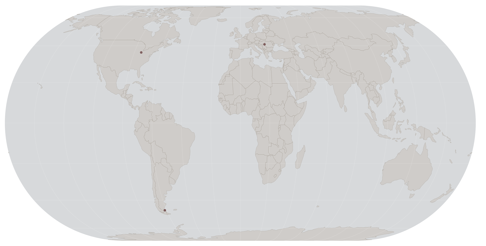
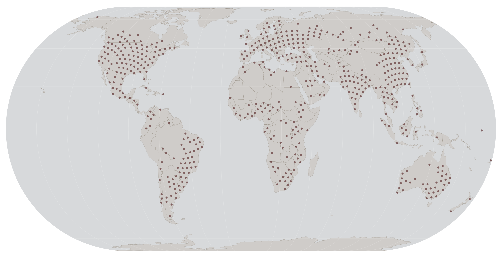

# An Evenly Distributed World - GeoGuessr Map

[GeoGuessr](https://www.geoguessr.com/) is a game in which the player is presented with a Google Street View (GSV) location, and they have to guess where they are. A player can select a "Map" to play, containing a selection of previously selected locations, either manually or automatically. Maps can cover the world or a subsection and can be designed around specific attributes like "Famous places" or "Cities". And anyone can create a map.

## Challenge

Create a map generated from evenly distributed geo locations, so any area of the world has the same likelihood of being presented to the player.

## Technical Proof of Concept

1. Evenly Distributed Points on a Sphere
    - To generate N points distributed mostly evenly on a sphere, I used a Fibonacci sphere / Golden spiral [algorithm](https://stackoverflow.com/questions/9600801/evenly-distributing-n-points-on-a-sphere).
2. (x,y,z) to (latitude,longitude)
    - The generated points have to be translated to geodetic points. The mechanism is described [here](https://en.wikipedia.org/wiki/Geographic_coordinate_conversion#From_ECEF_to_geodetic_coordinates). Example implementation [here](https://stackoverflow.com/questions/56945401/converting-xyz-coordinates-to-longitutde-latitude-in-python).
3. Find a nearby road
    - The Google Maps API allows me to do a [Reverse Geocoding lookup](https://developers.google.com/maps/documentation/geocoding/requests-reverse-geocoding) for a generated coordinate. By specifying a result type of 'street address', 'route', or 'intersection', I can acquire a new coordinate close to the original coordinate but on the road.
4. Check for available street view
    - Using a [Street View Metadata](https://developers.google.com/maps/documentation/streetview/metadata) request to the Google Maps API allows me to check if there's a Street View image on the new road coordinate.

### Test with a sphere of 100 points

Images are plotted using [this tool](https://dwtkns.com/pointplotter/).

Generated 100 points:

Points with roads (12 points):

Roads with Streetview (3 points):

### Test with a sphere of 5000 points

Generated 5000 points:

Generated 5000 points, zoomed to Europe:

Points with roads (552 points):

Roads with Streetview (72 points):

## Creating the map

I decided to start with 100000 points for the actual map, which should retain about 1500 locations. And also, I should be able to stay within the number of Google Maps API calls I can do for free.

When generating the 100000 points, the distribution looks like this:

### Optimize

About 70% of the earth is covered in water, where I won't find any nearby roads. So a quick optimization can eliminate most of the points on the water. To do this, I used [this library](https://pypi.org/project/global-land-mask/). Resulting in 28938 remaining points:

Not all countries have coverage in GSV. A simple way to reduce the number of points even more, is to eliminate the points in the not-covered countries. A list of covered countries can be found [here](https://en.wikipedia.org/wiki/Coverage_of_Google_Street_View). I also eliminated the points from countries with minimal coverage (e.g. only specific landmarks.)

To find out in which country a coordinate lies, I used the method described [here](https://github.com/che0/countries).

The resulting 19079 points are:

Zoomed to Europe, it looks like this:

### Resulting points

7805 roads were found:

1424 have Streetview:

### Resulting map

The map can be played [here]().

All location street views have been manually adjusted to suit my personal preference.

## A Biased Distributed World

The resulting points are not evenly distributed; at best, they are evenly distributed relative to the available coverage in road coverage and Streetview coverage. So the map is biased toward more western and more developed countries.

It seems the way to combat this would be to have A Curated World oriented towards having more evenly distributed locations.